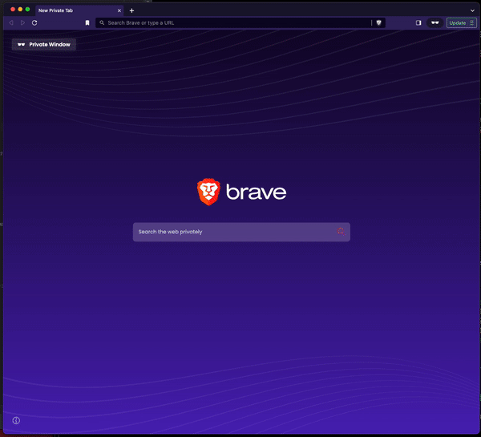
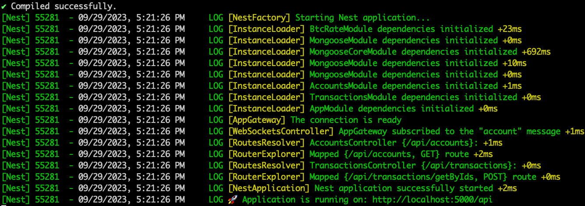

# CryptoTransactions

✨ **This workspace has been generated by [Nx, a Smart, fast and extensible build system.](https://nx.dev)** ✨

## App preview

## Repository structure
There are 4 branches in this repository:
- `main`: This branch contains the final version(part4) of the application.
- `part1`: This branch contains the first part of the application.
- `part2`: This branch contains the second part of the application.
- `part3`: This branch contains the third part of the application.

As there are some breaking changes among parts we prefer to have different branches for each part.

## Getting started
1. To ensure that you have `Node 18.16.0`. We recommend to use `nvm`, so you can run `nvm use` to select the correct node version based on the `.nvmrc` file.
2. Run `npm install`.
3. Run `npm run serve:all`. That way, you start the frontend and backend, on the other hand, our database is in Mongo Atlas DB.
4. Wait until everything is ready, you should see a screen similar to:

5. Go to `localhost:4200` and enjoy the app.
